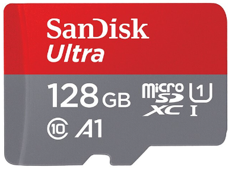

# 第 18.1 节 树莓派简介与配件选用

## 树莓派是什么？

我们常见的 Android 安卓手机、电视机顶盒处理器均基于 ARM 芯片。

树莓派就是一块基于 ARM 芯片的开发板，即一块接口丰富（HDMI、I²C、USB 2.0/3.0、I²S、CSI、GPIO、串口、RTC、PWM 风扇、DSI、PCIe（须转接）、POE 模块等）的电路板，相当于同期的千元红米手机（高通款），手机能做的事情，树莓派都能做。一般用于嵌入式开发，如机器人，路由器和监控等等。当然，这并非树莓派的初衷，树莓派是英国树莓派基金会的计算机教育产物。

>据称，树莓派最初的目标是为了拯救面临废系的剑桥大学计算机科学与技术系。
>
>经分析论证，教学主管认为主要原因是现在的小孩子没有便宜且开放的电脑可玩。
>
>~~“为了守护我们最爱的院系——我们所能做的，就是开发一块每个人都买得起的电路板！！”~~
>
>尽管《LoveLive!》以失败告终，但树莓派取得了巨大成功！

### 常见疑问解答

- 树莓派 4 以前的型号不如同期千元机，即使是树莓派 5 也仅相当于同代千元机。为什么不直接买二手的高端机？

答：手机确实配置高于树莓派，但是没有可扩展性（典型功能 GPIO）。

- 要可扩展性，为什么不直接买 X86 小主机？

答：首先，受限于散热（功耗墙）、电源供应，与树莓派物理尺寸（信用卡大小）相同的 x86 开发板（如 Raxda x4），其性能并不比树莓派高出多少，发热倒是上去了。其次，讨论比树莓派大的开发板亦没有意义。那不是一个类型的东西。

- 为什么不买基于瑞芯微（Rockchip）的 RK 3588/3528/35xx ？

答：所有瑞芯微的配套支持均十分欠缺，几乎只保证你能开机。**他可以标他支持 8K，但是有没有驱动就是你的问题了。** **他们并非基金会或设计用于教育目的。** 他们都是标准的商品，故相关配套产品应由其开发板提供商提供，**用户没有义务为其进行任何移植**（除非是工业开发，如果你付费，他们会提供支持）。拿来玩的用户需要的是开箱即用的产品，即使是开发板亦如此。如果你提供不了任何最基本的技术支持，或者需要用户自行维护 Linux 主线，那么我建议不要做成商业产品。如果需要用户来做这些本应由瑞芯微（或开发板制造商）去做的事，那么我建议瑞芯微开发板制造商应为其付费。**换言之，这压根就不是同类产品。瑞芯微更适合专业的从业者使用。**

>在某些人的思想中，这并非瑞芯微的问题，是用户的计算机技术不行，水平太低，也不想查手册花时间去学，动手去移植。瑞芯微已经很便宜了，没有义务提供这些。
>
>“整个行业都这样，反而树莓派才是异类。是你玩的开发板太少啦！”
>
>这些人已全然忘记 Ubuntu 这个来自非洲大地的词语本意。
>
>那么，我再说一遍：
>
>>你提供的是商业产品。故提供驱动程序、在生命周期内，集成到最新主线 LTS Linux 内核、长期维护的在线/离线文档、除开发板外的周边产品（外壳、电源、各种线缆和转接器、扩展板、散热器、天线等）、是你应尽的、且是最基本的义务。
>>
>>**不要试图将你的任何责任转嫁给用户，即使某些用户自己也拎不清。**
>>
>>**如果你提供不了任何最基本的技术支持，或者需要用户自行维护 Linux 主线，那么我建议不要做成商业产品。**

- 只有瑞芯微和博通可选？

答：还有更为节能的全志（Allwinner）处理器。

## 存储设备的随机读写重要性

**有必要先测试 U 盘/存储卡的 4K 读写速度**

自树莓派 3B+ 以降，无需任何改动，系统即可从 U 盘启动：经测试，FreeBSD 12/13/14 均支持，但是速度非常慢——一方面树莓派 3B+ 使用 USB2.0 极大的限制的总线速度（本身也不是最高速度的 SD 卡接口），另一方面是某些 U 盘的 4K 随机实在是太差了（测试用的是东芝（TOSHIBA）U364；最离谱的是金士顿 DT100G3，4K 随机竟然是 `0`，卡到爆炸）。

树莓派的 SD 卡接口限制了存储卡的速率，并不会太高，因此使用标称 100MB+ 的存储卡毫无体验，且对于树莓派来说，随机读写速率才是最重要的。

测试标准必须至少达到存储卡的 [A2 级别（读 4000 IOPS、写 2000 IOPS）](https://www.kingston.com/cn/blog/personal-storage/microsd-sd-memory-card-naming-conventions)。

——附 IOPS-MB 在线转换器：[IOPS, MB/s, GB/day Converter](https://wintelguy.com/iops-mbs-gbday-calc.pl)

## microSD 卡（存储卡/TF 卡/SD 卡/内存卡）参数简介

存储卡规范是由 [SD 协会](https://www.sdcard.org/)制定的。

SD 卡的标准十分混乱，甚至与 USB-IF 协会制定的 USB 标准相比，其混乱程度亦难分伯仲。这与 SD 卡协会脱不开关系。

SD 卡的标准之所以这么混乱，根源是因为在随时代发展的同时，SD 卡协会并不会弃用先前的旧标准（如放弃英制单位，使用公制单位），更不会提升之前的标准（如刷版本号），而是另行创建一个更高段的标准。**简言之，SD 卡存在多种并行的度量衡，且量程各有重叠和差异。**

上图是 microSD（微型）SD 卡，即树莓派使用的（仅最老的型号使用标准 SD 卡，目前这种标准 SD 卡“大卡”主要用于相机）。

microSD 也即我们所说的 TF 卡（类似于 EFI 和 UEFI 的关系）、手机存储卡。

这块闪迪的 microSD 卡，上面标有：

- `SanDisk Ultra`：`SanDisk` 是商标品牌名“闪迪”的英语；`Ultra` 是闪迪自己的型号款式——至尊高速款。
- `128 GB`：存储卡的容量是 128 GB。
- `C10`（`10` 环绕着圆形“C”符号）：该参数无效，不用看。现在所有卡标的都是 10，想找低于 10 的都难。
- `Mirco SD XC`（micro SDXC）：指该卡容量位于 32G-2TB 间；2G-32G 为“micro SDHC”。其他的，现在基本上见不到——容量小于 2G（microSD）或容量大于 2TB（microSDUC）。这个参数也没什么意义，因为必定是个卡上就标了容量大小。
- `U1`（`1` 环绕着圆形“U”符号）:`U1` 最低写入速度为 10MB/秒；U3 则为 30MB/秒。**没有 U2**。**只有老产品（U3）或低速设备（U1）会标**
- `1`（XC 右侧，U1 下方）：使用 UHS-I：总线最高为 104MB/秒；UHS-II 则为 312MB/秒。
- `A1`：随机读写速率。目前只有 A1、A2 两等，如果没标就是连 A1 都没到。树莓派须使用 A2 卡。

### 补充

-  `667x`、`1066x`：雷克沙等卡会标 667x、或 1066x，这种标识方法目前只有 CD 机、磁带机、光盘还在用，相当古老（二十世纪 80 年代）。1x=150 KB/s ——>①667x = 150KB/s x 667 ≈ 83MB/S；②1066x = 150KB/s x 1066 ≈ 156MB/S。
-  `V30`：新产品一般将 `U3` 标为 **V30**。不用找 V60，有但是非常贵（正常的 A2 卡 1 元 1G；V60 3 元 1G，但是似乎 V60 A2 没有共存的）V90 的 microSD 卡我没有见过。低于 V30 的也没见过，一般就标成 `U1`。速率标准换算：***C10 = U1 = V10*** 这 3 个东西其实是一回事，但同时标着。

总结：这块闪迪 microSD 存储卡上面标了 7 个参数，其中 4 个都是没用的。并且从参数上看，这款存储卡并不具什么优势，很平凡。

### 存储卡挑选总结

总结：对于树莓派：容量（推荐至少为 32G）、连续读写（至少 V30）、随机读写（A2）。但是现在是个卡就是这么标的，且树莓派本身达不到其 SD 卡设计的总线速率，**所以仅须看是 A1、还是 A2 这一个参数就可以了。**

一句话：买三星、闪迪的 A2 存储卡，由于真假难辨（就同 HDMI 线一样，可能整个市场只有个别店铺是真的）和售后问题，建议到京东 **自营** 购买（第三方视为拼多多）。

#### 贵就好？

>**部分贵的存储卡和便宜的没有区别**
>
>经过实际测试，京东自营一百多块钱的（雷克沙 667x、雷克沙 1066x）存储卡和淘宝几块钱的并没有任何区别。

#### 参数标称就符合？

**标称参数与实际测试效果严重不符也是常有的事**

>>**扩容卡看起来已不再是常态**
>
>在过去，廉价的大容量存储卡往往是扩容的，但是这种卡连树莓派启动盘制作工具都通不过，因为该工具内置了镜像校验程序。如果标称容量和实际对不上，就无法完成镜像写入。所以，对于树莓派不必考虑这种问题。另外现在的存储颗粒已经非常廉价了，一般不至于再这么做。如果不是容量非常离谱（>128G)，一般都不存在这种问题。

>>**部分标称参数与实际测试不符**
>
>**移速（MOVE SPEED）** 参数与实际测试效果严重不符。尤其是其声称的 A2 V60 参数的 TF 卡。
>
>这些 A2 存储卡，实际测试 4k 读写只有不到 1.5MB/s，快赶上那个金士顿 DT100G3 了。这已经不是虚标的问题了。

## 参考文献

- [树莓派官方文档简体中文版](https://rpicn.bsdcn.org)
- [Inside the Raspberry Pi: The story of the $35 computer that changed the world](https://www.techrepublic.com/article/inside-the-raspberry-pi-the-story-of-the-35-computer-that-changed-the-world/)
- [SD 卡和 microSD 卡类型指南](https://www.kingston.com/cn/blog/personal-storage/microsd-sd-memory-card-guide)
- [SD 卡 和 microSD 卡速度等级指南](https://www.kingston.com/cn/blog/personal-storage/memory-card-speed-classes)
- [了解 SD 卡和 microSD 卡的命名惯例和标签](https://www.kingston.com/cn/blog/personal-storage/microsd-sd-memory-card-naming-conventions)
- [電腦概論中的考古題，關於光碟機的倍數是指什麼](https://www.mobile01.com/topicdetail.php?f=300&t=2126605&p=3)
- [移速（MOVE SPEED）64GB TF（MicroSD）存储卡测试](https://www.bilibili.com/read/mobile?id=21681916)
- [移速这个卡虚标了，速度只有标注的二分之一](https://post.m.smzdm.com/talk/p/az6o8zkr/)
- [Mvespeed移速400G内存卡简单测评](https://post.m.smzdm.com/p/arq759g7/)
- [移速TF卡翻不翻车？看来没翻（附游戏测试）](https://post.m.smzdm.com/p/awzqn9z4/)